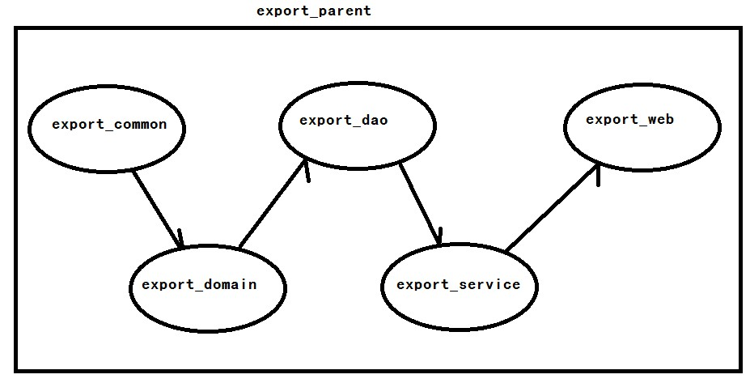
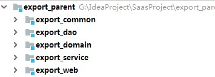

# SaasExport货代云平台
SaasExport_SSM_项目练习用
主要分为以下功能模块:
* 权限管理:对登入系统的员工进行细粒度权限的控制
* 货物管理:提供货物的全流程管理,包括商品详情,报价等
* 报运管理:包括购销合同,出口报运,装箱,委托,发票,财务等.
* 统计管理:以图形化界面对销售,财务数据展示.
## 1.系统架构
 ### 开发环境
 * JDK1.8
 * Maven3.3.9
 * idea 2018
 * 数据库 5.7
 ### 框架组合
 * 后端框架采用 Spring + SpringMVC + Mybatis +Dubbo
 * 前端采用AdminLTE框架的前端解决方案
 * 一套完整的权限设计方案
 * Shiro安全控制框架
 * Dubbo 分布式治理框架
 * Excel导入导出  POI类库
 * PDF的导出  jasper
 * 定时任务 Quartz  springTask
 * 远程调用技术   webservice
 ### 工程依赖结构
 
 
