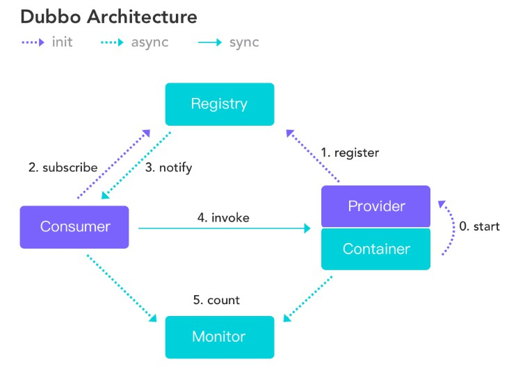

# SaasExport货代云平台
SaasExport_SSM_项目练习用
主要分为以下功能模块:
* 权限管理:对登入系统的员工进行细粒度权限的控制
* 货物管理:提供货物的全流程管理,包括商品详情,报价等
* 报运管理:包括购销合同,出口报运,装箱,委托,发票,财务等.
* 统计管理:以图形化界面对销售,财务数据展示.
## 1.系统架构
 ### 开发环境
 * JDK1.8
 * Maven3.3.9
 * idea 2018
 * 数据库 5.7
 ### 框架组合
 * 后端框架采用 Spring + SpringMVC + Mybatis +Dubbo
 * 前端采用AdminLTE框架的前端解决方案
 * 一套完整的权限设计方案
 * Shiro安全控制框架
 * Dubbo 分布式治理框架
 * Excel导入导出  POI类库
 * PDF的导出  jasper
 * 定时任务 Quartz  springTask
 * 远程调用技术   webservice
 ### 工程依赖结构
 
 
***
 ### Dubbo配置
   因为各服务之间的相互调用,且只部署在同一天服务器上,压力太高,为了
   降低压力同时减少耦合度,在后来又加入了Dubbo作为远程调用框架.
   Dubbo作为一个RPC框架，其最核心的功能就是要实现跨网络的远程调用,
   这样就实现了不同服务器之间各服务的相互调用,同时使用zookeeper作为
   注册中心来统一服务的提供者和服务的消费者。  
   通过Dubbo协议来实现服务消费者远程调用服务提供者的方法。
   
   - Consumer: 服务消费者  
   - Provider: 服务提供者  
   - Container: 服务容器  
   - invoke: 服务消费者调用服务提供者  

    - tools中的zookeeper为注册中心,在启动项目前启动tools/zookeeper-3.4.8/bin/zkServer.cmd即可开启注册中心
    
    - dubbo-admin.2.6.0为Dubbo可视化管理控制台,将该war包放入tomcat的webapps下启动tomcat即可启动该控制台,默认账号密码为root
    
 ### 配置Dubbo完成后项目结构
   
   
 ## 2.项目业务逻辑 
  ### 货运管理
   #### 购销合同
   
   